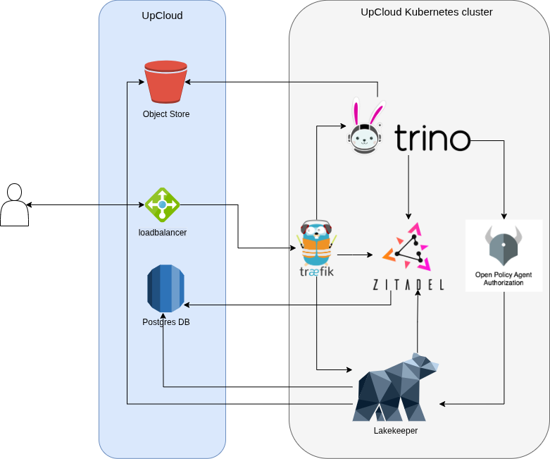
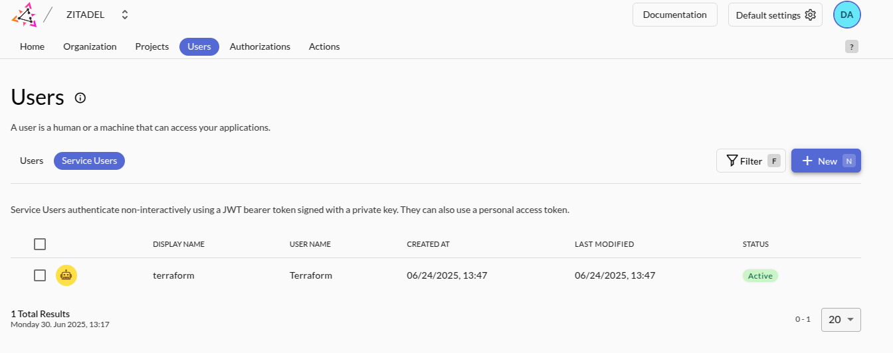
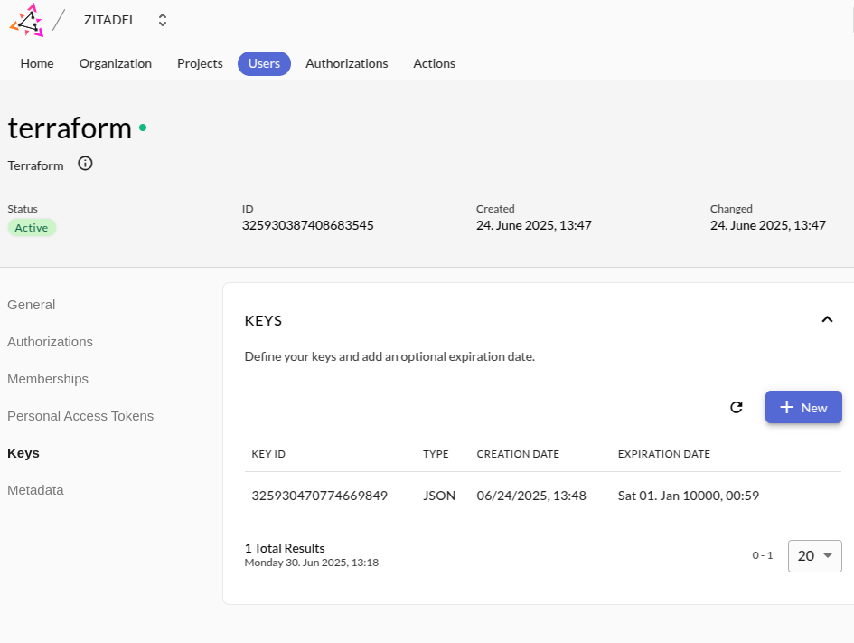

<!-- PROJECT SHIELDS -->
[![Contributors][contributors-shield]][contributors-url]
[![Forks][forks-shield]][forks-url]
[![APACHE License][license-shield]][license-url]

# Upcloud data platform

This repo contains the code for building an open-source data platform on [Upcloud](https://upcloud.com/).

The platform contains the infrastructure and configuration for a lakehouse data platform based on the following open-source components:
* Trino: the distributed query engine on top (semi) structured data. It provides a SQL interface to our data.
* Lakekeeper: data catalog for Iceberg tables as wll as restricted access to Iceberg tables
* Zitadel: for identity and access management of users as well as services
* Open Policy Agent: for implementing fine-grained access control within Trino, Lakekeeper
* Airflow: for orchestration of data pipelines
* Traefik: as an ingress controller and supporting SSL termination

## Architecture



The core of the platform is a Trino cluster, providing a SQL-like interface to data. This is used by
* data engineers who can query the data via a database client
* jobs scheduled by Airflow

## Interacting with the Platform
The Data Engineers interact with the platform via the Airflow UI and via a database client connecting to Trino.

# Deploying the platform

The platform team can deploy the infrastructure in this repository using [OpenTofu](https://opentofu.org/).

## Tools needed

* [OpenTofu](https://opentofu.org/)
* [Kubectl](https://kubernetes.io/docs/reference/kubectl/)
* [Helm](https://helm.sh/)

## Prerequisites

* Create an [Upcloud account](https://hub.upcloud.com) and verify it, which requires adding a credit card. This ensures that you can provision the resources needed for this project.
* Create a subaccount in Upcloud, this is the account that will be used by terraform to create all resources. 
  It will have access to the API and you will need to give it permissions to create the resources needed for this project.
  For more information, see [Upcloud documentation](https://upcloud.com/docs/guides/getting-started-upcloud-api/).
* make sure you have a hosted domain for the data platform services. Many of the provisioned services require SSL, which requires a valid hostname. 
  You can use your favorite DNS provider and use a subdomain of a domain that you own.

## Infra deployment

1. If you already have a storage bucket for the terraform state, you can skip this step. If not, go to `infra/bootstrap`, make sure to expose UPCLOUD_USERNAME, UPCLOUD_PASSWORD as environment variables and run `tofu init` and `tofu apply`.
2. Go to the `infra/upcloud` folder and create a `terraform.tfvars` file using the `terraform.tfvars.example`. You can also check the default values in `variables.tf` and update them if needed.
  - The `storage_bucket_domain_name` and `storage_bucket_name` can be found in the output of the bootstrap step.
  - Make sure you configure your AWS s3 credentials for the `upcloud` profile (we use the AWS profile `upcloud` in `infra/foundation/state.tf`).
  Add the necessary configuration to the `.aws/config` and `.aws/credentials` file. For full details, look at the [Upcloud object storage overview](https://hub.upcloud.com/object-storage/2.0) in your object storage for S3 programmatic access.
3. Run `tofu init -var-file=terraform.tfvars` in the `infra/foundation` folder to initialize the terraform backend.
4. Run `tofu apply -var-file=terraform.tfvars -target=upcloud_kubernetes_cluster.this -target=upcloud_kubernetes_node_group.default_group -target=upcloud_managed_database_postgresql.db` in the `infra/foundation` to create the kubernetes cluster that you need. This will take a while (10-15 minutes).
5. Test the access to the kubernetes cluster:
  - run `export KUBECONFIG=$(pwd)/.kubeconfig.yml` from the `infra/foundation` folder
  - run `kubectl get nodes` to see if you can access the cluster
6.  Run `tofu apply -var-file=terraform.tfvars -target=module.traefik` in the `infra/foundation` to create the application proxy and load balancer for kubernetes.
  While this is running, check the upcloud console for the public IP address assigned to the load balancer. This IP address needs to be added as an A record in your DNS provider for the domain name you configured.
7. Run `tofu apply -var-file=terraform.tfvars` in the `infra/foundation` to create the rest of the resources.

If all went well, you should now have access to Zitadel, go to `https://zitadel.<your-domain>` to login. The initial credentials can be found in `modules/zitadel/main.tf`. 
- Go to the service users tab and create a new service user. 
- Make sure to assign the service user to the `Org owner` and the `Iam owner` roles.
- Create a key for the service user. Zitadel will create the json key that you need for the Terraform provider. 
- Put the key in the `infra/apps` directory as `token.json`

8. Create the `terraform.tfvars` using the provided template, the organization ID can be retrieved from the Zitadel UI.
9. run `tofu apply -var-file=terraform.tfvars` in the `infra/apps` directory to setup the remaining services.

## Your first query

1. Run `tofu output s3_warehouse_info` in the `infra/foundation` folder to get the S3 information required for the lakekeeper warehouse.
2. Go to the Lakekeeper UI at `https://lakekeeper.<your-domain>/ui` and login. Now create a new warehouse using the following settings:
```
Warehouse Name: iceberg
Storage Type: s3
Bucket: <BUCKET_NAME from s3_warehouse_info>
Key Prefix: <PREFIX you want in the bucket>
Assume Role ARN: /
Endpoint: <ENDPOINT from s3_warehouse_info>
Region : <REGION from s3_warehouse_info>
Path Style Access: /
STS Role ARN: /
STS Enabled: No
Flavor: s3-compat
```

3. Now use a SQL client (e.g. DBeaver) or trino CLI to connect to Trino at `https://trino.<your-domain>`.
4. Run the following commands to create a new Iceberg table:
```
CREATE SCHEMA iceberg.demo;
CREATE TABLE iceberg.demo.yearly_clicks(year, clicks) as VALUES (2021,10000),(2022,20000)
SELECT * FROM iceberg.demo.yearly_clicks;
```

[contributors-shield]: https://img.shields.io/github/contributors/datamindedbe/demo-upcloud-data-platform.svg?style=for-the-badge

[contributors-url]: https://github.com/datamindedbe/demo-upcloud-data-platform/graphs/contributors

[forks-shield]: https://img.shields.io/github/forks/datamindedbe/demo-upcloud-data-platform.svg?style=for-the-badge

[forks-url]: https://github.com/datamindedbe/demo-upcloud-data-platform/network/members

[license-shield]: https://img.shields.io/github/license/datamindedbe/demo-upcloud-data-platform.svg?label=license&style=for-the-badge

[license-url]: https://github.com/datamindedbe/demo-upcloud-data-platform/blob/master/LICENSE.md