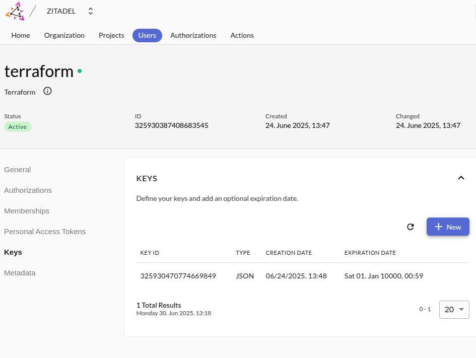

# Deploying an open-source data platform on Upcloud

This tutorial walks you through setting up a cloud-agnostic, open-source data platform on Upcloud [opentofu](https://opentofu.org/). 
All the necessary code is available in [Github](https://github.com/datamindedbe/demo-upcloud-data-platform)

Estimated deployment time: ~30–45 minutes (most of it waiting for the Kubernetes cluster, Load balancer and managed database to be ready). 
Expected cost: ~10€X/day for the demo setup.”

## Architecture overview

Before we start, here is a high-level overview of the architecture and components used in this demo data platform.


- **[Trino](https://trino.io/)**: A distributed SQL engine for interactive queries across large and small datasets
  It allows us to build a data warehouse on Upcloud without depending on a managed service.
- **[Lakekeeper](https://docs.lakekeeper.io/)**: The production-ready metadata catalog for Iceberg tables, tightly integrated with Trino and OPA. 
- **[Open policy agent (OPA)]()**: A general-purpose policy engine used here to enforce fine-grained data access control.
- **[Traefik](https://traefik.io/)**: A reverse proxy and ingress controller that manages SSL termination and routes traffic to the different services of our data platform.
- **[Zitadel](https://zitadel.com/)**: An identity and access management platform that handles user and application authentication, with support for integration into your company’s identity provider.

## Prerequisites
Before starting the deployment, make sure you have:

- A verified [Upcloud account](https://upcloud.com) with an API enabled subaccount for creating resources.
- A hosted domain and DNS provider (e.g., Route53, GoDaddy) for assigning a subdomain to the data platform stack.
- Installed [OpenTofu](https://opentofu.org/), [kubectl](https://kubernetes.io/docs/reference/kubectl/), AWS CLI (for the S3-compatible object storage backend)

Before diving into infra deployment, include quick sanity checks:
```bash
tofu --version
kubectl version --client
helm version
aws --version
```
## Deploying the platform
Now you are ready to start deploying the platform on Upcloud.

### Step 1: Clone the repo and bootstrap Opentofu state storage

```bash
git clone https://github.com/datamindedbe/demo-upcloud-data-platform.git
cd demo-upcloud-data-platform
```

As a first step, we need to create the OpenTofu state storage such that our OpenTofu state is stored remotely and can be used by multiple people at the same time.

- export your Upcloud user credentials in your current environment:
```bash
export UPCLOUD_USERNAME="your_upcloud_username"
export UPCLOUD_PASSWORD="your_upcloud_password"
```

- go to the bootstrap folder and initialize backend, which will create an S3 bucket for our state files
```bash
cd infra/bootstrap
tofu init
tofu apply
```
When successful, the outputs will print `storage_bucket_name` and `storage_bucket_domain_name`

### Step 2: Deploy the core infrastructure (Kubernetes, Postgres, Traefik, Zitadel)
Next, we will create the core infrastructure which will be needed by all our other platform applications.
All the infrastructure code is in the `infra/foundation` folder.

- create `terraform.tfvars` from the `terraform.tfvars.example` and update the variables as needed

- In order to use the S3-compatible object storage as a backend for OpenTofu, you need to configure your AWS CLI with a profile named `upcloud`.
  You can find the necessary steps in the [Upcloud object storage overview](https://hub.upcloud.com/object-storage/2.0) in your object storage for S3 programmatic access.

- Setup our Postgres database and Kubernetes cluster, which can take 10-15 minutes:
```bash
tofu init -var-file=terraform.tfvars
tofu apply -var-file=terraform.tfvars \
-target=upcloud_kubernetes_cluster.this \
-target=upcloud_kubernetes_node_group.default_group \
-target=upcloud_managed_database_postgresql.db
```

- After the cluster is ready you can inspect the pods/nodes:
```bash
export KUBECONFIG=$(pwd)/.kubeconfig.yml
kubectl get nodes
```

- Next up is Traefik, which will create a load balancer with a public IP address and expose our applications to the outside world.
```bash
tofu apply -var-file=terraform.tfvars -target=module.traefik
```

After 5 minutes, Upcloud will assign a public IP address to the load balancer. You can find this in the Upcloud console under Load Balancers -> Services.
In order to get DNS working, you need to add an A record in your DNS provider that points to the load balancer IP address.

- Finally, you can create the remaining foundation resources using:
```bash
tofu apply -var-file=terraform.tfvars
```

In order to validate that everything is working correctly, make sure that the zitadel service is reachable at `https://zitadel.<your-domain>` (replace <your-domain> with the domain you configured).
The login page looks like this: 
If this is not working, double check your DNS configuration and the Traefik, Zitadel pods in kubernetes for any errors.

### Step 3: Create a Zitadel service user
Before we can setup the remainder of our stack, we need to create a service user in Zitadel.
This will allow us to configure authentication (using oauth) for every application on our stack.

- Go to the service users tab and create a new service user. 
- Make sure to assign the service user the `Org owner` and `Iam owner` roles.
- Create a key for the service user. Zitadel will create the json key that you need for the OpenTofu provider. 
- Put the key in the `infra/apps` directory as a `token.json` file.
- Look up the organization ID in the Zitadel UI, you will need it in the next step.

### Step 4: Deploy the platform applications (Trino, Lakekeeper, OPA)
Now we are ready to deploy the applications that make up our data platform stack: OPA, Lakekeeper and Trino.

- create `terraform.tfvars` from the `terraform.tfvars.example` and update the variables as needed.
- Apply all resources in the `infra/apps` folder as follows:
```bash
tofu init -var-file=terraform.tfvars
tofu apply -var-file=terraform.tfvars
```

## Troubleshooting tips

- Trino won’t start? Check `kubectl get pods -n services -l app.kubernetes.io/instance=trino` and `kubectl logs -n services <pod-name>` for crash logs.
- DNS not resolving, getting connection refused when browsing to one of the services? Make sure the A record is added to your DNS provicer with the Traefik LB IP.
- SSL certificate errors? Check the logs of the traefik pod `kubectl logs -n traefik <traefik-pod-name>`. Also double check your Loadbalancer configuration in Upcloud.
- Zitadel login fails? Verify that your DNS + SSL certificates are configured correctly.

## Using the data platform

Now that the full stack is deployed, you can start using it.

### Configure your warehouse in Lakekeeper
Before you can run SQL queries, you need to configure a Lakekeeper warehouse that points to the S3-compatible object storage.

To get the necessary information, run the following command in the `infra/foundation` folder:
```bash
tofu output s3_warehouse_info
```

Now go to the Lakekeeper UI at `https://lakekeeper.<your-domain>/ui` and login. 
From there click on `Warehouses` in the left menu and then click on `Create Warehouse`.
Fill in the form using the information retrieved from the previous command.

### Running your first SQL queries
You can now run your first SQL queries against Trino. You can use your favorite SQL client that supports Trino or use the Trino CLI.

- Download the Trino CLI if you haven't done this already:
```bash
curl -o trino https://repo1.maven.org/maven2/io/trino/trino-cli/476/trino-cli-476-executable.jar
chmod a+x trino
```
- Connect to Trino using the CLI:
```bash
trino --server trino.<your-domain> --user <zitadel-admin-email>
```

- Execute queries inside Trino:
```SQL
-- Find available catalogs & schemas:

SHOW CATALOGS;
-- check the schemas in the iceberg catalog
SHOW SCHEMAS FROM iceberg;

-- Create a demo schema and table, insert some data and run a few queries
CREATE SCHEMA IF NOT EXISTS iceberg.demo;

CREATE TABLE IF NOT EXISTS iceberg.demo.events (
id BIGINT,
user_name VARCHAR,
event_type VARCHAR,
ts TIMESTAMP
);

INSERT INTO iceberg.demo.events (id, user_name, event_type, ts) VALUES
(1, 'alice', 'login', TIMESTAMP '2025-09-18 08:00:00'),
(2, 'bob',   'click', TIMESTAMP '2025-09-18 08:05:00');

SELECT event_type, count(*) as cnt FROM iceberg.demo.events GROUP BY event_type;
SELECT * FROM iceberg.demo.events ORDER BY ts DESC LIMIT 10;
```

Congratulations! Your open-source data platform is now live on Upcloud. You can connect to Trino, create Iceberg tables, insert sample data, and query it using SQL.

## Next steps
In order to make this stack production ready, you will need to take care of the following:

- Harden OPA policies to enforce strict access cotnrol in Trino and Lakekeeper At the moment we allow all actions, but we provide the necessary rego files to restrict access using Lakekeeper.
  For more information, check [our blog on the topic](https://medium.com/datamindedbe/locking-down-your-data-fine-grained-data-access-on-eu-clouds-41e3d5108062) as well as the [Lakekeeper OPA bridge](https://docs.lakekeeper.io/docs/latest/opa/) for the details.
- Enable Zitadel based OIDC authentication for both uses and inter-service communication.
- Enable autoscaling of your kubernetes cluster by deploying the [cluster-autoscaler](https://upcloud.com/docs/guides/cluster-autoscaler/).
- Extend the stack with additional components such as Airflow for orchestration, Hashicorp Vault for secret management.

## Cleaning up
If you want to tear down the platform, you can do it as follows:
```bash
cd infra/apps
tofu destroy -var-file=terraform.tfvars

cd ../foundation
tofu destroy -var-file=terraform.tfvars -target=module.traefik -target=module.zitadel
# Now you can destroy the rest of the resources
tofu destroy -var-file=terraform.tfvars

cd ../bootstrap
tofu destroy
```

## Support
If you have any questions or run into issues, feel free to open an issue in this Github repo or reach out to me (`niels.claeys@dataminded.com`) or anyone else at Dataminded.

If you want guidance on how to extend this stack or make it production ready, reach out to us at [DataMinded](https://www.dataminded.com/contact).