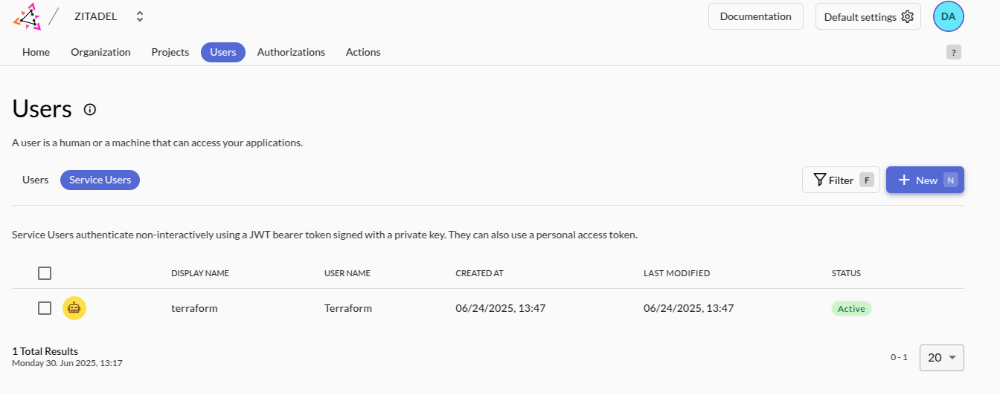

# Setting up a data-platform on Upcloud

This tutorial will guide you through how to setup a dataplatform on top of Upcloud using [opentofu](https://opentofu.org/). 
All the necessary code is available in [Github](https://github.com/datamindedbe/demo-upcloud-data-platform)

## Architecture overview

Before we start, here is a high-level overview of the architecture and components used in this demo data platform.


- **[Trino](https://trino.io/)**: distributed SQL query engine. It is designed to handle both small and large scale datasets and supports a wide range of data sources.
  It allows us to setup a data warehouse ourselves in environments that have no managed service for it.
- **[Lakekeeper](https://docs.lakekeeper.io/)**: The production-ready data catalog to store metadata about our iceberg tables. 
- **Open policy agent (OPA)**: The general-purpose policy engine. This will be used to enforce fine-grained access control in Trino and Lakekeeper.
- **[Traefik](https://traefik.io/)**: The application proxy for our full data platform stack. It allows us to configure SSL and routing to the different services.
- **[Zitadel](https://zitadel.com/)**: Perform authentication management for users as well as applications and integrate with your company's identity provider.

## Prerequisites
Before you can start applying the data platform stack, make sure you have the following in place:

- An [Upcloud account](https://upcloud.com) and a verified (sub)account with API access. This subaccount will be used by terraform to create all resources.
- A hosted domain for the data platform services. You can use your favorite DNS provider (e.g. Route53, Godaddy,..) and use a subdomain of a domain that you own.
- Install [OpenTofu](https://opentofu.org/)
- Have AWS CLI installed and configured (for the S3-compatible object storage backend)
- Install [kubectl](https://kubernetes.io/docs/reference/kubectl/)

## Deploying the platform
Now you are ready to start deploying the platform on Upcloud.

### Clone our repo and initialize the backend

```
git clone https://github.com/datamindedbe/demo-upcloud-data-platform.git
cd demo-upcloud-data-platform
```

As a first step, we need to create the terraform state storage such that our terraform state is stored remotely and can be used by multiple people at the same time.

- export your Upcloud user credentials in your current environment:
```
export UPCLOUD_USERNAME="your_upcloud_username"
export UPCLOUD_PASSWORD="your_upcloud_password"
```

- go to the bootstrap folder and initialize backend, which will create an S3 bucket for our state files
```
cd infra/bootstrap
tofu init
tofu apply
```
When successful, the outputs will print `storage_bucket_name` and `storage_bucket_domain_name`

### Create the foundation of our data platform
Next, we will create the kubernetes cluster, managed database, another storage bucket and zitadel and traefik which will be needed by all our other applications.
All the infrastructure code is in the `infra/foundation` folder.

- create `terraform.tfvars` from the `terraform.tfvars.example` and update the variables as needed

- In order to use the S3-compatible object storage as a backend for terraform, you need to configure your AWS CLI with a profile named `upcloud`.
  You can find the necessary steps in the [Upcloud object storage overview](https://hub.upcloud.com/object-storage/2.0) in your object storage for S3 programmatic access.

- Setup our Postgres database and Kubernetes cluster, which can take 10-15 minutes:
```
tofu init -var-file=terraform.tfvars
tofu apply -var-file=terraform.tfvars \
-target=upcloud_kubernetes_cluster.this \
-target=upcloud_kubernetes_node_group.default_group \
-target=upcloud_managed_database_postgresql.db
```

- After the cluster is ready you can inspect the pods/nodes:
```
export KUBECONFIG=$(pwd)/.kubeconfig.yml
kubectl get nodes
```

- Next up is Traefik, which will create a load balancer with a public IP address and expose our applications to the outside world.
```
tofu apply -var-file=terraform.tfvars -target=module.traefik
```

After 5 minutes, Upcloud will assign a public IP address to the load balancer. You can find this in the Upcloud console under Load Balancers -> Services.
In order to get DNS working, you need to add an A record in your DNS provider that points to the load balancer IP address.

- Finally, you can create the remaining foundation resources using:
```
tofu apply -var-file=terraform.tfvars
```

In order to validate that everything is working correctly, make sure that the zitadel service is reachable at `https://zitadel.<your-domain>` (replace <your-domain> with the domain you configured).
If this is not working, double check your DNS configuration and the Traefik, Zitadel pods in kubernetes for any errors.


### Create a service user in Zitadel 
Before we can setup the remainder of our stakc, we need to create a service user in Zitadel.
This will allow us to configure authentication (using oauth) for every application on our stack.

- Go to the service users tab and create a new service user. 
- Make sure to assign the service user the `Org owner` and `Iam owner` roles.
- Create a key for the service user. Zitadel will create the json key that you need for the Terraform provider. 
- Put the key in the `infra/apps` directory as a `token.json` file.
- Look up the organization ID in the Zitadel UI, you will need it in the next step.

### Deploy our applications
Now we are ready to deploy the applications that make up our data platform stack: OPA, Lakekeeper and Trino.

- create `terraform.tfvars` from the `terraform.tfvars.example` and update the variables as needed.
- Apply all resources in the `infra/apps` folder as follows:
```
tofu init -var-file=terraform.tfvars
tofu apply -var-file=terraform.tfvars
```

### Configure your warehouse
Before you can run SQL queries, you need to configure a Lakekeeper warehouse that points to the S3-compatible object storage that we have just created.

To get the necessary information, run the following command in the `infra/foundation` folder:
```
tofu output s3_warehouse_info
```

Now go to the Lakekeeper UI at `https://lakekeeper.<your-domain>/ui` and login. 
From there click on `Warehouses` in the left menu and then click on `Create Warehouse`.
Fill in the form using the information retrieved from the previous command.

### Running your first query
You can now run your first SQL queries against Trino. You can use your favorite SQL client that supports Trino or use the Trino CLI.

- Download the Trino CLI if you haven't done this already:
```
curl -o trino https://repo1.maven.org/maven2/io/trino/trino-cli/476/trino-cli-476-executable.jar
chmod a+x trino
```
- Connect to Trino using the CLI:
```
trino --server trino.<your-domain> --user <zitadel-admin-email>
```

- Execute queries inside Trino:
```
-- Find available catalogs & schemas:

SHOW CATALOGS;
-- check the schemas in the iceberg catalog
SHOW SCHEMAS FROM iceberg;

-- Create a demo schema and table, insert some data and run a few queries
CREATE SCHEMA IF NOT EXISTS iceberg.demo;

CREATE TABLE IF NOT EXISTS iceberg.demo.events (
id BIGINT,
user_name VARCHAR,
event_type VARCHAR,
ts TIMESTAMP
);

INSERT INTO iceberg.demo.events (id, user_name, event_type, ts) VALUES
(1, 'alice', 'login', TIMESTAMP '2025-09-18 08:00:00'),
(2, 'bob',   'click', TIMESTAMP '2025-09-18 08:05:00');

SELECT event_type, count(*) as cnt FROM iceberg.demo.events GROUP BY event_type;
SELECT * FROM iceberg.demo.events ORDER BY ts DESC LIMIT 10;
```

Congratulations, you have a fully working the open-source data platform on Upcloud. 
You can connect to Trino, create your first Iceberg tables, insert sample data, and query it using SQL. 

### Next steps
In order to make this stack production ready, you will need to take care of the following:

- Secure OPA policies to restrict access to Trino and Lakekeeper as much as possible. At the moment we allow all actions, but we provide the necessary rego files to restrict access using Lakekeeper.
  For more information, check the [Lakekeeper OPA bridge](https://docs.lakekeeper.io/docs/latest/opa/) for the details.
- Enable authentication on Trino and Lakekeeper using Zitadel as the OIDC provider. This should be done for users accessing these services as well as the communication between Trino and Lakekeeper.
- Add extra components that you might need, like:
  - Airflow for orchestrating your ETL jobs
  - Hashicorp Vault for managing secrets

## Support
If you have any questions or run into issues, feel free to open an issue in this Github repo or reach out to me (`niels.claeys@dataminded.com`) or anyone else at Dataminded.

If you want guidance on how to extend this stack or make it production ready, reach out to us at [DataMinded](https://www.dataminded.com/contact).